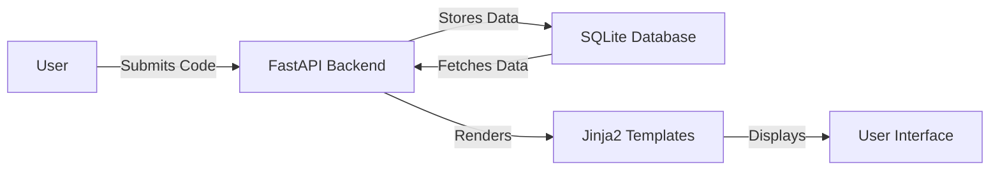

# AI-Powered Code Review Assistant

## Overview
The AI-Powered Code Review Assistant is a web application designed to enhance code quality through AI-generated review suggestions. It provides a platform for developers to submit their code and receive automated feedback to improve their coding practices. This tool is especially beneficial for software developers, code reviewers, and teams looking to streamline their code review process and ensure consistent code quality. By leveraging AI, the application offers insightful suggestions that help developers refactor and optimize their code efficiently.

## Features
- **Code Submission**: Users can submit their code for review directly through a user-friendly web interface.
- **AI-Generated Suggestions**: Automatically receive suggestions on how to improve the submitted code.
- **Review Dashboard**: A comprehensive dashboard that displays all code submissions and their respective AI-generated suggestions.
- **User Profiles**: View user-specific information and their submission history.
- **Statistics**: Access detailed statistics about total submissions and suggestions generated.
- **Responsive Design**: The application is designed to be responsive and works well on a variety of devices.

## Tech Stack
| Component        | Technology        |
|------------------|-------------------|
| Backend          | FastAPI           |
| Frontend         | HTML, CSS, JS     |
| Database         | SQLite            |
| Server           | Uvicorn           |
| Templating       | Jinja2            |

## Architecture
The project is structured with a FastAPI backend serving HTML templates via Jinja2. The application interacts with an SQLite database to manage user data, code submissions, and review suggestions. The frontend is served using HTML, CSS, and JavaScript, providing a seamless user experience.



## Getting Started

### Prerequisites
- Python 3.11+
- pip (Python package installer)
- Docker (optional for containerized deployment)

### Installation
1. Clone the repository:
   ```bash
   git clone https://github.com/yourusername/ai-powered-code-review-assistant-auto.git
   cd ai-powered-code-review-assistant-auto
   ```
2. Install the dependencies:
   ```bash
   pip install -r requirements.txt
   ```

### Running the Application
1. Start the FastAPI server:
   ```bash
   uvicorn app:app --reload
   ```
2. Visit the application at `http://localhost:8000`

## API Endpoints
| Method | Path                       | Description                                      |
|--------|----------------------------|--------------------------------------------------|
| GET    | `/`                        | Home page                                        |
| GET    | `/submit`                  | Code submission page                             |
| GET    | `/reviews`                 | Review dashboard page                            |
| GET    | `/profile`                 | User profile page                                |
| GET    | `/stats`                   | Statistics page                                  |
| POST   | `/api/code/submit`         | Submit code via API                              |
| GET    | `/api/reviews`             | Get all code submissions and suggestions         |
| GET    | `/api/user/{user_id}/profile` | Get user profile and submissions               |
| GET    | `/api/stats`               | Get statistics for submissions and suggestions   |

## Project Structure
```
.
├── Dockerfile                   # Docker configuration for containerization
├── app.py                       # Main application file with FastAPI setup
├── requirements.txt             # List of Python dependencies
├── start.sh                     # Shell script to start the application
├── static/
│   ├── css/
│   │   └── style.css            # Custom styles for the application
│   └── js/
│       └── main.js              # JavaScript for client-side functionality
├── templates/
│   ├── index.html               # Home page template
│   ├── profile.html             # User profile page template
│   ├── reviews.html             # Review dashboard template
│   ├── stats.html               # Statistics page template
│   └── submit.html              # Code submission page template
└── database.db                  # SQLite database file
```

## Screenshots
*Screenshots of the application interfaces will be added here.*

## Docker Deployment
To deploy the application using Docker, use the following commands:
```bash
docker build -t ai-code-review-assistant .
docker run -d -p 8000:8000 ai-code-review-assistant
```

## Contributing
Contributions are welcome! Please follow these steps:
1. Fork the repository.
2. Create a new branch (`git checkout -b feature/YourFeature`).
3. Commit your changes (`git commit -m 'Add some feature'`).
4. Push to the branch (`git push origin feature/YourFeature`).
5. Open a Pull Request.

## License
This project is licensed under the MIT License.

---
Built with Python and FastAPI.